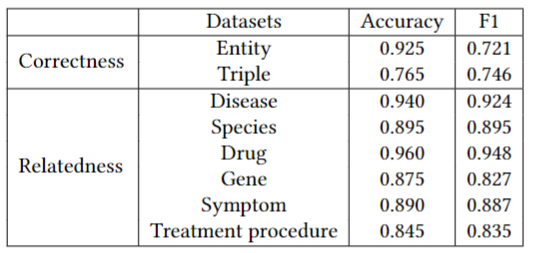

# Evaluating Knowlege Graph Quality: A CORD-19 Knowledge Graph Use Case

## Dataset

## Triples

## Knowledge graph evaluation

## Q&A system
### Queries and groundtruth
### Retrieving answers
### EVALUATION
#### Knowledge Graph
##### Evaluation metrics
- Comprehensiveness: ```|K ∩ W|/|W|```
- Relatedness: ```|Ri |/|Ai |, Ri ∈ Ai, i ∈ {ti , ..., tn }```
- Correctness: ```|C |/|A|, C ∈ A```

To train BERT-based model and use it to automatically evaluate the Relatedness and Correctness of the ten KGs, run the command:
```
nohup python3 /home/huyen/CORD-19-KG/Evaluation/auto_eval_correct_related_BERT_ent.py > /home/huyen/CORD-19-KG/Evaluation/auto_eval_correct_related_BERT_ent.out &
nohup python3 /home/huyen/CORD-19-KG/Evaluation/auto_eval_correct_related_BERT_triple.py > /home/huyen/CORD-19-KG/Evaluation/auto_eval_correct_related_BERT_triple.out &
```
Our BERT-based models' performance:


#### Q&A system
##### Evaluation metrics
```
precision = tp/(tp+fp)	
recall=tp/(tp+fn)	
F1 =  (2 * Precision * Recall)/Precision + Recall)	
Accuracy = tp/(tp+fn)	
```

where:
- tp: number of terms* that are shared between the correct answer and the prediction.
- fp: number of terms that are in the prediction but not in the correct answer.
- fn: number of terms that are in the correct answer but not in the prediction. [^1]
[^1]: https://kierszbaumsamuel.medium.com/f1-score-in-nlp-span-based-qa-task-5b115a5e7d41


